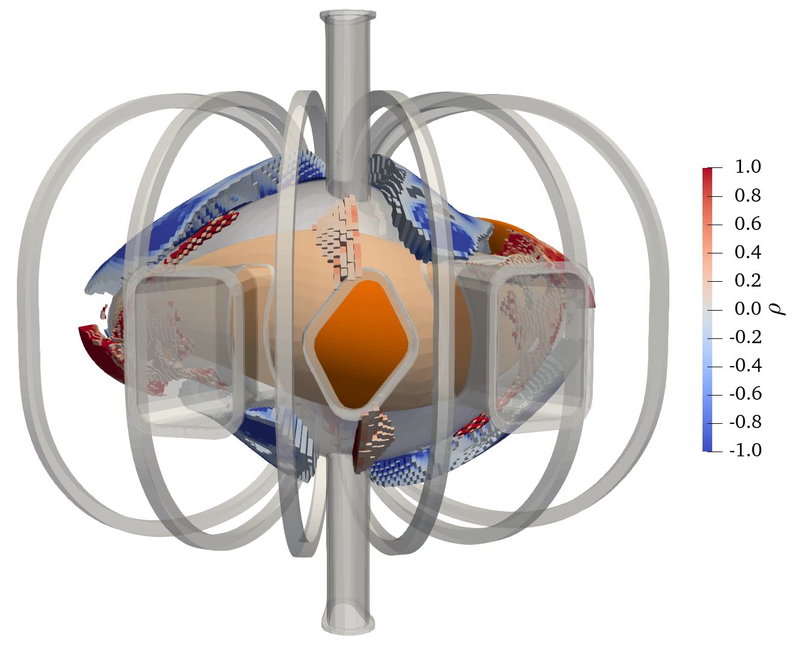


# Flexbile Advanced Magnets Used for Stellarators (FAMUS)

FAMUS is a variant of [FOCUS](index.md) specialized for designing permanent magnets.
It uses a topology optimization method to determine the presence of magnets in the entire designing space.
FAMUS can optimize the magnitude and/or orientation of permanent magnet in the form of magnetic dipole subject to explicit forbidden regions and material remanence.
For more details, please check [Zhu, C. et al. (2020) ‘Topology optimization of permanent magnets for stellarators’, Nuclear Fusion (2020)](https:doi.org/10.1088/1741-4326/aba453) (preprint at [arXiv:2005.05504](http://arxiv.org/abs/2005.05504)).

FAMUS is in the `dipole` branch of the FOCUS [repository](https://github.com/PrincetonUniversity/FOCUS/tree/dipole), although it has been modified a lot.
It shares similiar I/O with FOCUS, but there are differences.

## Input files
- Input namelist
- Target plasma boundary
- Initial dipoles
  

## Objective functions
- Normal field error
  \$$ F_B = \iint_{\cal S} \left ( \vec{B}_{M} \cdot \vec{n} - B_n^{tgt} \right )^2 d{a} $$
  
  This function makes sure the prodcued magnetic field statisfies the boundary condition.
- Total magnetic moment
  \$$ F_M = \sum_i {m_i}^2. $$
  
  This function will try to reduce the total amount of used magnets.
- Binary Dipoles
  \$$ F_D = \sum |\rho|(1 - |\rho|) , \; \mathrm{where} \; \rho = p^q \in [-1,1] $$. 
  
  This objective encourages PM cells to be either 0 or 1 instead of intermediary values.

## Optimization algorithms
- Quasi-Newton (QN)
- Simulated Annealing (SA)
- Hybrid of QN & SA (HY)

## Outputs

## Utility tools

## References
